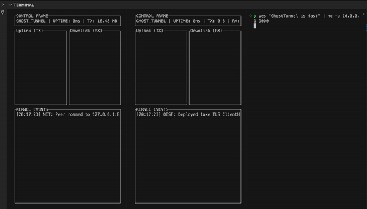
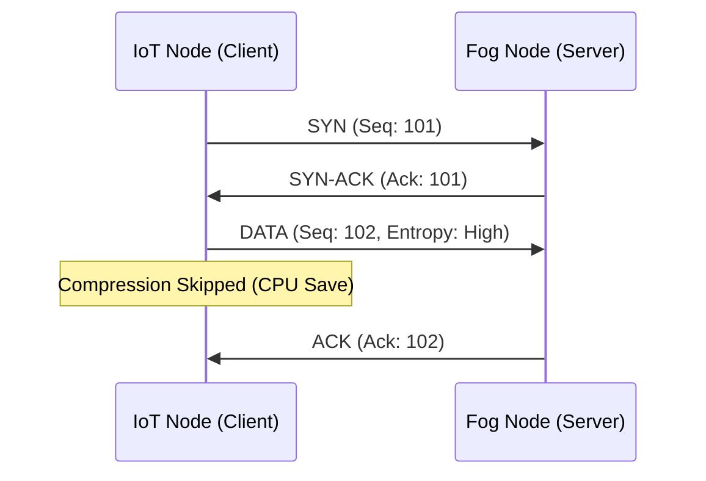

# ResiliNet: A Resilient UDP Transport Layer for Adaptive IoT Orchestration!





ResiliNet is a userspace, reliable-UDP transport protocol designed to mitigate TCP Meltdown in high-latency, lossy IoT environments. It is engineered to support the orchestration of adaptive, distributed workflows on resource-constrained edge devices (simulating 4G/LTE rural deployments).

## 1. Research Motivation

Traditional VPN tunneling protocols (e.g., OpenVPN over TCP) exhibit performance degradation known as **Head-of-Line (HoL) Blocking** when packet loss exceeds **5%**. In edge computing scenarios, this results in:

- **TCP Meltdown**: Exponential backoff synchronization between the inner and outer transport layers.
- **Control Plane Partitioning**: Inability to orchestrate edge nodes during network brownouts.

ResiliNet addresses these by implementing a decoupled congestion control mechanism and entropy-based payload adaptation.

## 2. Core Capabilities

| Module | Feature | System Benefit |
| :--- | :--- | :--- |
| **Transport** | Userspace ARQ | Guarantees delivery of control signals without stalling the entire data stream (Stop-and-Wait). |
| **Optimization** | Adaptive Zstd | Heuristic entropy detection ($H(x) > 7.5$) disables compression for encrypted payloads to conserve IoT battery/CPU. |
| **Security** | Traffic Morphing | Injects Gaussian jitter ($0-15ms$) to flatten Inter-Arrival Time (IAT) histograms, mitigating traffic analysis. |
| **Telemetry** | Headless TUI | `ratatui`-based dashboard for real-time monitoring of packet loss and jitter on headless gateways. |

## 3. Architecture

The system operates as a Layer 3 Overlay Network. Data is intercepted via a TUN interface, encapsulated in a custom ResiliNet frame, and transmitted via raw UDP sockets.



## 4. Evaluation & Usage

### Prerequisites
- **OS**: Linux (Kernel 5.4+) or macOS (with TunTap)
- **Privileges**: Root/Sudo (required for `ioctl` calls to virtual interfaces)

### Building
```bash
cargo build --release
```

### Reproducing Packet Loss Resilience
To demonstrate resilience, we run the client in "Chaos Mode" (simulating 20% random packet loss).

#### 1. Start the Fog Node (Server):
Open **Terminal A**
```bash
# Binds to port 8080 and listens for incoming tunnels
sudo ./target/release/resilinet --bind 0.0.0.0:8080 --tun-ip 10.0.0.1
```

#### 2. Start the Edge Node (Client) with Chaos:
Open **Terminal B**
```bash
# Connects to localhost:8080 but drops 20% of packets artificially
sudo ./target/release/resilinet \
  --bind 0.0.0.0:9000 \
  --peer 127.0.0.1:8080 \
  --tun-ip 10.0.0.2 \
  --chaos
```

### Telemetry Dashboard
Once connected, the TUI (Terminal User Interface) will visualize the throughput and the "recovered" packets that would have otherwise been lost.

## 5. Future Work (DCW Roadmap)

This prototype serves as the foundation for a Directed Course Work (DCW) proposal. Future objectives include:

- **Formal Verification**: Modeling the sliding window protocol in TLA+.
- **Auditability**: Integrating an immutable session ledger for access control compliance.
- **FEC**: Implementing Forward Error Correction (Reed-Solomon) for video stream resilience.